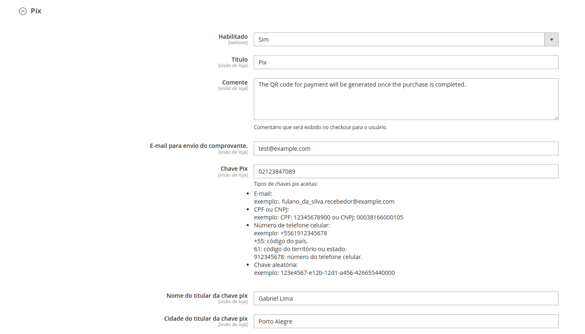

# Pix QR Code

##### english README
- [README (en)](https://github.com/GabrielFNLima/magento2-pixqrcode/wiki/README-(en))

Este módulo é um meio de pagamento que gerar um QR Code estático com o valor do pedido para o cliente ao
finalizar a compra.

Recomendo consultar
o [Manual de Padrões para Iniciação do Pix](https://www.bcb.gov.br/content/estabilidadefinanceira/pix/Regulamento_Pix/II_ManualdePadroesparaIniciacaodoPix.pdf)
para obter mais informações sobre o QR Code estático.

> É importante ressaltar que, ao utilizar o QR Code estático, o status de pagamento não é atualizado automaticamente na
> loja Magento. Portanto, é necessário que o cliente envie o comprovante de pagamento para o vendedor e o vendedor
> atualize manualmente o pedido.

## Instalação

### Via Composer

Para instalar o módulo Pix Qrcode via Composer, siga os seguintes passos:

1 - Baixe o módulo utilizando o Composer. No terminal, navegue até a raiz do seu projeto Magento e execute o seguinte
comando:

```bash
composer require gfnl/magento2-pixqrcode
```

Isso baixará o módulo Pix Qrcode e suas dependências necessárias.

2 - Habilite o módulo executando os seguintes comandos na raiz do seu projeto Magento

```bash
bin/magento module:enable GFNL_PixQrCode
```

```bash
bin/magento setup:upgrade
```

### Manualmente

O módulo possui uma dependência com o pacote [chillerlan/php-qrcode](https://github.com/chillerlan/php-qrcode).

Para adicionar esse pacote ao Magento, basta executar o seguinte comando:

```bash
composer require chillerlan/php-qrcode 
```

Certifique-se de que você esteja executando o comando na raiz do seu projeto Magento.

Após adicionar a dependência, siga os passos abaixo para adicionar o módulo:

1 - No diretório raiz do seu projeto Magento, execute o seguinte comando para criar o diretório do módulo:

```bash
mkdir -p app/code/GFNL/PixQrCode
```

2 - Faça o download da última versão disponível do módulo:

```bash
wget wget https://github.com/GabrielFNLima/magento2-pixqrcode/releases/latest/download/magento2-pixqrcode.zip -P app/code/GFNL/PixQrCode/
```

3 - Descompacte o módulo e remova o arquivo .zip:

```bash
unzip app/code/GFNL/PixQrCode/magento2-pixqrcode.zip -d app/code/GFNL/PixQrCode/
```

```bash
rm app/code/GFNL/PixQrCode/magento2-pixqrcode.zip
```

4 - Habilite o módulo executando os seguintes comandos:

```bash
bin/magento module:enable GFNL_PixQrCode
```

```bash
bin/magento setup:upgrade
```

## Configuração

Para acessar as configurações do meio de pagamento Pix no Magento, vai em
***Lojas > Configuração > Vendas > Formas de pagamento > Pix***


